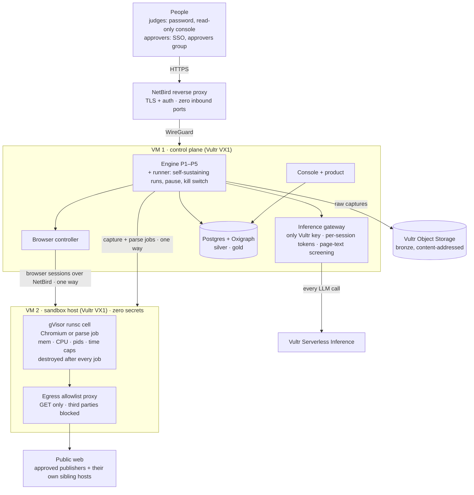
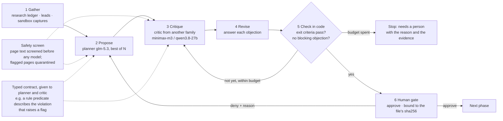
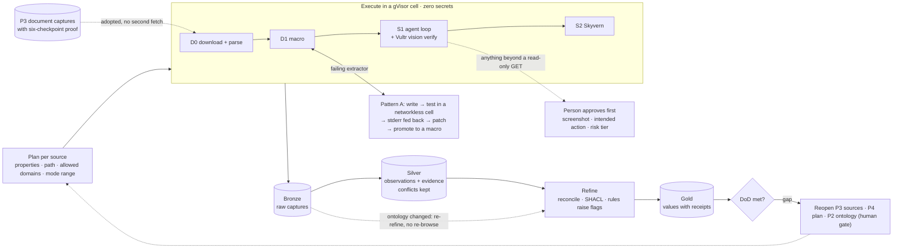

# Ontofill: any open question → an evidence-backed dataset, run safely on Vultr

Ontofill turns an open brief into a reviewed PRD and definition of done, an ontology,
source objectives, scoped extraction plans, and a dataset whose values link back to
captured public evidence. Vultr inference makes the typed decisions; isolated sandbox
jobs capture sources; the lake keeps raw evidence, observations, and validated exports.
The engine accepts a **case** from an application repo and runs the same five phases for
different subjects. [Proveedor Abierto](https://github.com/ricalanis/proveedor-abierto/tree/main/case)
is the reference case used to exercise the engine.

**For judges:** [Live, read-only Ontofill Console](https://ontofill-console-judges.eu1.netbird.services).
The password is linked from [Proveedor Abierto's For judges section](https://github.com/ricalanis/proveedor-abierto#for-judges),
which also states where each case stands.

## What is proven live (Sun 27 Sep)

- **Two Vultr VMs, one boundary.** The control VM plans every phase on Vultr Serverless Inference and dispatches
  work; the sandbox VM runs each job in a gVisor (`runsc`) cell with memory, CPU, process and time caps, and
  destroys it afterwards. Every job reports six proof checks: host check, task result, where it ran, isolation
  probe (BLOCKED), teardown, and secret hygiene (0 keys in the cell; cloud metadata IP and mesh BLOCKED).
- **One key, outside the sandbox.** Only the inference gateway on the control VM holds the Vultr key. It issues
  per-session tokens, attributes every call to a run and step, and screens captured page text before it reaches a
  model. The console's Inference view shows each call and its provider.
- **Containment.** A hostile page (prompt injection plus attempts to reach the metadata IP) is quarantined and
  flagged, and an extractor that runs `rm -rf /` and then loops forever
  (`sandbox/fixtures/destructive_loop.py`) is killed by its cell's limits with a host sentinel intact
  (`tools/containment`, recorded run in the console).
- **Pattern B vision verification.** A Vultr vision model (`qwen3.8-27b`) judges a sandboxed browser cell's
  screenshot against the step goal: proven live in a controller session. The case runs so far used document and
  page capture, so their traces show no vision steps yet.
- **Pattern A, self-healing extractors.** The engine writes an extractor and runs it in a networkless cell against
  stored captures. Live runs show both halves: a passing extractor promoted to a versioned macro, and a failing one
  whose output diff is fed back for a patch and retry, then escalated to the browser after the attempt cap.
- **People only approve.** A run stops at the PRD, factors, ontology and source-review checkpoints. Each decision in
  the console is bound to the sha256 of the exact artifact reviewed and appended to the case's decision log; a deny
  with a reason makes the engine redraft. The runner service resumes the run with no operator in the loop.
- **Generic by construction.** The same code runs the Mexican procurement case and an unrelated San Francisco
  library case, each from a one-paragraph brief.
- **Honest gap.** The reference case has **no engine gold yet**. The sandbox allowlist first refused the primary
  procurement portal's data API. It now admits that portal's own API and CDN hosts (`378a8c0`), GET only, with
  third-party hosts blocked and POSTs refused, so the blast radius stayed zero while egress widened, and the portal
  renders inside the sandbox. Its contract files, though, are served only through a POST carrying an anti-bot
  token, so the read-only engine stops and flags it, by design. The engine is now being taught to find official
  open-contracting (OCDS) publications instead. Work continues after submission, live on the judges console.
- **Building in the open.** A simpler second case (San Francisco library branches) surfaced seven engine defects
  that the hard case had hidden. Six are fixed with tests:
  - city-level jurisdictions in P1
  - invalid ontology rules, now set aside with salvage in P2
  - a rule critic that read red-flag rules as passing checks (`829559e`)
  - a core PRD field never bound to a property (`3c1a2b0`, verified live)
  - compiled DoD thresholds re-authored instead of copied from the approved PRD
  - exhausted phases reported as a crash instead of needs-human

  The case is now approved through the ontology and discovering sources. One defect is in progress: criteria
  written as "≤ 0" compile to counts that can never be met.

  *Updated 11:54: nine found (R57, R58, R58b, R59, R60, R63, R64, R64b, R66). Six are verified fixed live. R64 and
  R64b are deployed (`7eb528c`) and await verification. R66 is in progress: at P3 the source critic rejected the
  library's own branch pages and asked for a second publisher, contrary to the PRD.*

## Post-submission updates

The project was submitted on Sun 27 Sep before the 12:00 PT deadline, and the 1-minute video is fixed as of then.
Every change after submission is listed here, newest first, with its commit. Text written before submission is
kept; where a fact changed, the text carries an "Updated HH:MM" note. The running status of both cases is in
[Proveedor Abierto's "Where things stand"](https://github.com/ricalanis/proveedor-abierto#where-things-stand-sun-27-sep-1755-utc).

| When (PT) | Commit | What changed |
|-----------|--------|--------------|
| Sun 12:46 | [lessons below](#what-the-sf-case-taught-the-engine-added-1246) | Five engine lessons from the SF case, each with its status. |
| Sun 11:55–12:35 | [`da8d8e9`](https://github.com/ricalanis/ontofill/commit/da8d8e9), [`5af4ec2`](https://github.com/ricalanis/ontofill/commit/5af4ec2), [`9500cf8`](https://github.com/ricalanis/ontofill/commit/9500cf8), [`c326ec6`](https://github.com/ricalanis/ontofill/commit/c326ec6) | Pushed to main: official open-contracting (OCDS) discovery and parsing, for Proveedor Abierto's next attempt at gold. Deploy and verification not yet reported. |
| Sun 11:58–12:30 | [`491d35e`](https://github.com/ricalanis/ontofill/commit/491d35e), [`06ed252`](https://github.com/ricalanis/ontofill/commit/06ed252), [`da92d1c`](https://github.com/ricalanis/ontofill/commit/da92d1c), [`ca7e256`](https://github.com/ricalanis/ontofill/commit/ca7e256) | Pushed to main: listings laid out as repeated blocks parse as one row per entity; the source critic asks only for the corroboration the approved PRD requires (R66); discovery resumes from a durable checkpoint. Deploy and verification not yet reported. |
| Sun 11:54 | deployed VM HEAD [`7eb528c`](https://github.com/ricalanis/ontofill/commit/7eb528c) (engine code through [`52235c5`](https://github.com/ricalanis/ontofill/commit/52235c5): R64/R64b) | The engine on the control VM now carries the R64/R64b definition-of-done fixes: zero-only criteria are set aside, each criterion compiles to its own query, and completeness counts all entities. It also adds a parser preview for large datasets and clean source-link labels. Verification is pending until the SF case runs on it. |
| Sun 11:52 | [run `run-09ed86537750`](https://ontofill-console-judges.eu1.netbird.services/cases/sf-library-branches/runs/run-09ed86537750) | The SF case stopped at P3 discovery. The source critic rejected sfpl.org's branch pages ("no tabular listing") and asked for a second independent publisher, which the PRD does not require. Logged as R66; fix in progress. |
| Sun 11:49 | [`0b81af0`](https://github.com/ricalanis/ontofill/commit/0b81af0) | The status bullets above now match the submitted claims. They still read "six defects, five fixed" and "the run continues". |
| Sun 11:44–11:48 | [`e226669`](https://github.com/ricalanis/ontofill/commit/e226669), [`52235c5`](https://github.com/ricalanis/ontofill/commit/52235c5) | R64/R64b definition-of-done fixes: "≤ 0" criteria and explicit completeness shares no longer compile to counts that can never be met. Awaiting deploy at the SF case's next checkpoint. |


### What the SF case taught the engine (added 12:46)

The simpler SF case exposed five general gaps in the engine, not SF-specific patches. Evidence is in each run's
trace on the judges console.

| Lesson | Seen in the SF and Mexico runs | Status |
|--------|---------------|--------|
| 1. Never stop before judging | One run spent its phase-3 time budget on sandbox captures and stopped before the critic ran, then reported "no source" | next |
| 2. Reuse what is already captured | sfpl.org/locations was captured and parsed again in four runs; captures should be reused across runs by URL and content hash | after the event |
| 3. Model publishers, not hostnames | data.sfgov.org moved to data.sf.gov, and CompraNet to ComprasMX; a publisher's move should go to a person's review, not a hard block | after the event |
| 4. Don't spend budget on non-content | Stylesheets and favicons were followed and captured in sandbox jobs | next |
| 5. Critics judge against the approved contract, never built-in defaults | The same bug four times: the rule convention, a second-publisher demand, re-authored DoD thresholds, and a deny reason that never reached the DoD compiler | partly fixed (`829559e`, `da92d1c`, R63, R64) |

## How it works

The engine turns a question into a reviewed PRD, an inferred ontology, confirmed sources,
bounded collection, and linked data with evidence for each value. See
[From an open question to linked data](docs/planning/04-question-to-linked-data.md)
for the steps and the artifacts they produce.

## The engine in three diagrams

**1. Global: two Vultr VMs, one boundary.** People reach the system only through the NetBird proxy. The control
plane plans on Vultr Serverless Inference through the gateway, which holds the only key, and dispatches jobs one way
to gVisor cells that hold no secrets.



**2. The council: how the engine decides.** Every phase runs the same bounded loop. A planner proposes, a critic
from another model family objects, and code checks the exit criteria. A person approves or denies with a reason, and
that reason becomes a human revision the loop can never override. The models choose within typed options; code owns
the order, the budgets and the stop rules.



The same loop drafts the PRD (P1), the ontology (P2), judges sources (P3), writes each per-source plan (P4), and
runs the gap loop after gold.

**3. Extraction: from a plan to gold with receipts.** Each (source, objective) gets a plan. Execution starts at the
cheapest mode and climbs only when a check fails. Bronze is kept, so a changed ontology re-refines gold without
browsing again.



## Runs on Vultr and NetBird

Vultr provides inference, the control and sandbox VMs, and the evidence lake. NetBird
connects the VMs and provides access without public inbound ports. See
[How Ontofill uses Vultr and NetBird](docs/reference/vultr-netbird-usage.md)
for the deployed layout and network boundaries.

Tracked files contain code and documentation only. Recorded previews use the ignored `.cache/`
directory for a scratch case, local bronze objects, and silver observations.

| Folder | What goes there |
|--------|-----------------|
| `src/ontofill/` | The engine package: phases, executor, refiner, inference, lake adapters, sandbox control |
| `packages/ontofill-scrape/` | Resilience-first scraping toolkit, separately usable (tool contract, failures, policies) |
| `sandbox/` | Browser/spider pod images (Docker + gVisor), egress policy |
| `infra/` | Vultr VMs, Object Storage, Postgres, Oxigraph, NetBird (zero open ports) |
| `schemas/` | JSON Schemas for the case-package file formats the engine reads/writes |
| `tests/` | Unit tests and replay tests on stored captures |
| `docs/` | Definition docs (copied from planning) |

License: Apache-2.0. See `docs/planning/01-engine-definition.md`.

## Built during the event

Built during the Vultr Agent Arena (Sat 11:30 → Sun 12:00 PT). Before the event this repository held the
definition documents and an empty package scaffold (`a648775`, Sat 13:31). Everything else was built during the
event, in the granular public [commit history](https://github.com/ricalanis/ontofill/commits/main)
(about 400 commits; the suite runs 720 tests on `main`). By work block:

| When (PT) | What was built | Example commits |
|-----------|----------------|-----------------|
| Sat 13:31–14:13 | Contract, file and S3 lake adapters, the scrape toolkit, live run feed, sandbox job proof feed | `56f7324`, `571aaae`, `a7e2cd1` |
| Sat 14:53–15:51 | Live Vultr typed decisions with an independent critic, ontology-driven refine and export, the native gVisor browser cell | `5c44202`, `2818822`, `6076a6d` |
| Sat 16:03–18:15 | Vultr provisioning, isolated Skyvern cell, checkpoint deny steering, PRD and gateway proof checkpoints, the engine on the screened gateway token | `dd811a8`, `62126e8`, `1ef6e4d` |
| Sat 18:48–20:56 | P5 connected to the browser controller, teardown proof, containment command, runner service with kill switch, console Inference and Summary views, honest taxonomy metrics, screening of captured content | `7774775`, `a86cb3c`, `fdc8dd7`, `bf8d9b2` |
| Sat 21:10–Sun 03:47 | Sandbox document parsing, stable digest-bound approvals, source-review checkpoint, direct document parsing in P5, reviewed download gate, jurisdiction guard | `e2429dc`, `91d2c82`, `fd9ce1f`, `e76d552` |
| Sun 04:46–10:24 | Fixes driven by the real case's live runs: budget and wall-clock accounting, wide authority policy, entity anchors and query rotation for discovery, the document profiler, SPA request capture, P2 rule salvage | `936d0cc`, `b217f02`, `933ce27`, `0474139`, `f9a3fb7` |

Each live failure on the real case was filed with its evidence, fixed in code with a test, deployed in a window
with no engine running, and rerun. Nothing in a run was edited by hand.

## Try a second brief through the ontology checkpoint

This uses the unrelated public-library brief in `tests/genericity`. Run these commands
from the Ontofill repo root with `ONTOFILL_GATEWAY_TOKEN` and the gateway's
`VULTR_INFERENCE_BASE_URL` in the ignored `.env`.
The explicit `run-` ID rejects a recorded fallback. All case files and lake objects go
under a new ignored `.cache/` directory; this does not touch the reference case.

```sh
mkdir -p .cache
demo_root="$(mktemp -d "$PWD/.cache/library.XXXXXX")"
mkdir -p "$demo_root/case"
cp tests/genericity/cases/libraries/brief.md "$demo_root/case/brief.md"
demo_run="run-library-$(date +%s)"
run_library() {
  LAKE_ROOT="$demo_root/lake" SILVER_DATABASE_URL= OXIGRAPH_URL= \
    uv run ontofill run "$demo_root/case" --to-phase 2 \
      --run-id "$demo_run" --budget-usd 1.00
}
run_library
```

The first call stops at `01-scope/APPROVAL_PENDING.md` with exit code 3. After a human
reviews and accepts `prd.json` and its DoD basis, this scratch-only helper writes an
approval bound to the exact file bytes:

```sh
approve_reviewed() {
  uv run python - "$demo_root/case" "$1" "$2" "$demo_run" <<'PY'
import hashlib, json, sys
from datetime import UTC, datetime
from pathlib import Path
root, relative, checkpoint = Path(sys.argv[1]), sys.argv[2], sys.argv[3]
artifact = root / relative
marker = {
    "approver": "Local reviewer", "date": datetime.now(UTC).date().isoformat(),
    "checkpoint": checkpoint, "identity_source": "local", "run_id": sys.argv[4],
    "artifact_sha256": {relative: hashlib.sha256(artifact.read_bytes()).hexdigest()},
}
(artifact.parent / "APPROVED").write_text(json.dumps(marker) + "\n", encoding="utf-8")
PY
}
approve_reviewed 01-scope/prd.json prd
run_library
# Review factors.json before continuing:
approve_reviewed 02-ontology/factors/factors.json factors
run_library
```

The final call stops at `02-ontology/APPROVAL_PENDING.md` with a live
`ontology.json` ready for review. Keep the same `demo_root` and `demo_run` values.
A denial with a reason regenerates the rejected artifact on the next call; it never
skips a checkpoint. See [the approval schema](schemas/approved.schema.json).

## Run the reference case

```sh
uv sync
uv run ontofill run ../proveedor-abierto/case
```

With no Vultr inference credentials, `run` uses a clearly labeled recorded decision double.
It generates a `mock-` run in `.cache/case-mock/`, returns exit code 3 for outstanding human
checkpoints, and never advances the case's latest pointers. Source URLs are discovered at
runtime from the case brief; values are emitted only from observed public cells.

With `ONTOFILL_GATEWAY_TOKEN` and `VULTR_INFERENCE_BASE_URL` set in the ignored
`.env`, the engine selects a live Vultr model through the screened gateway,
regenerates recorded artifacts, pauses for PRD, factors, and ontology approvals,
and resumes on the next `run`. The application owns its case directory and approval
markers. `AWS_ACCESS_KEY_ID` and `AWS_SECRET_ACCESS_KEY` enable Vultr Object Storage
through the S3 lake adapter.
